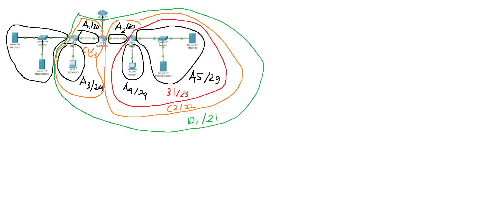
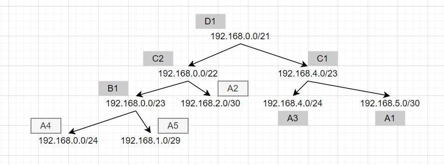
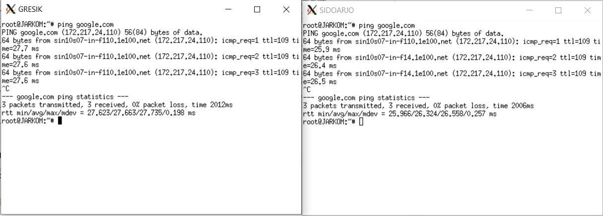
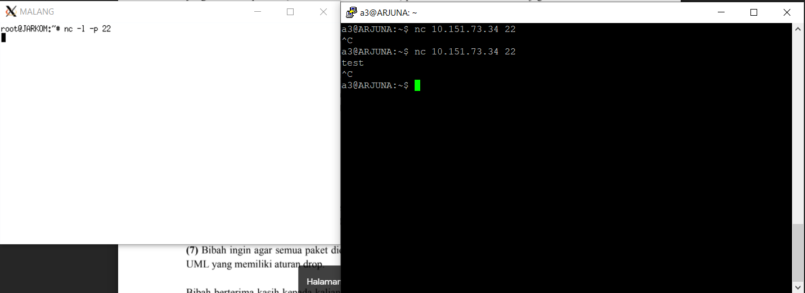
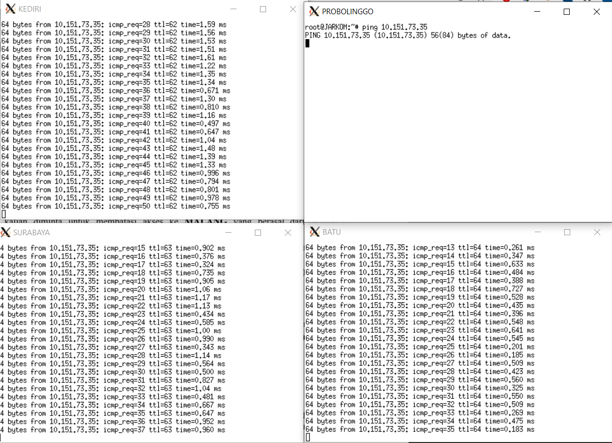
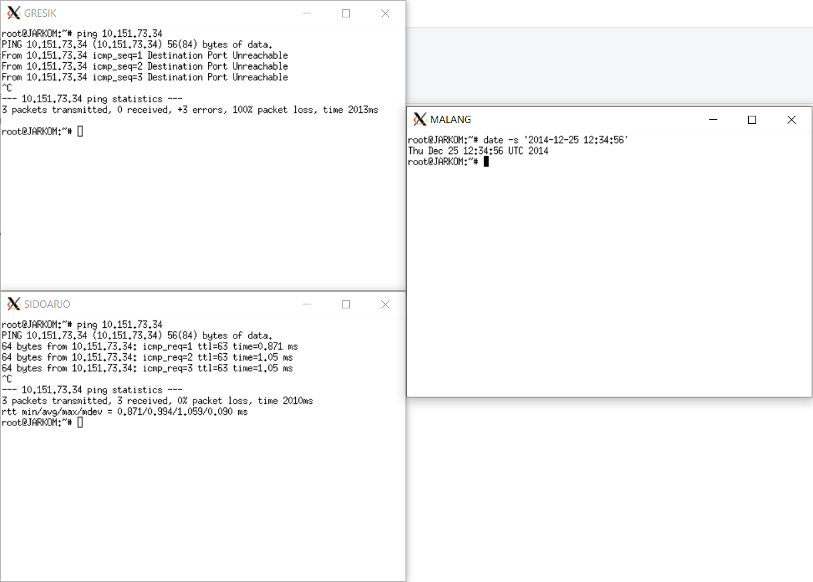
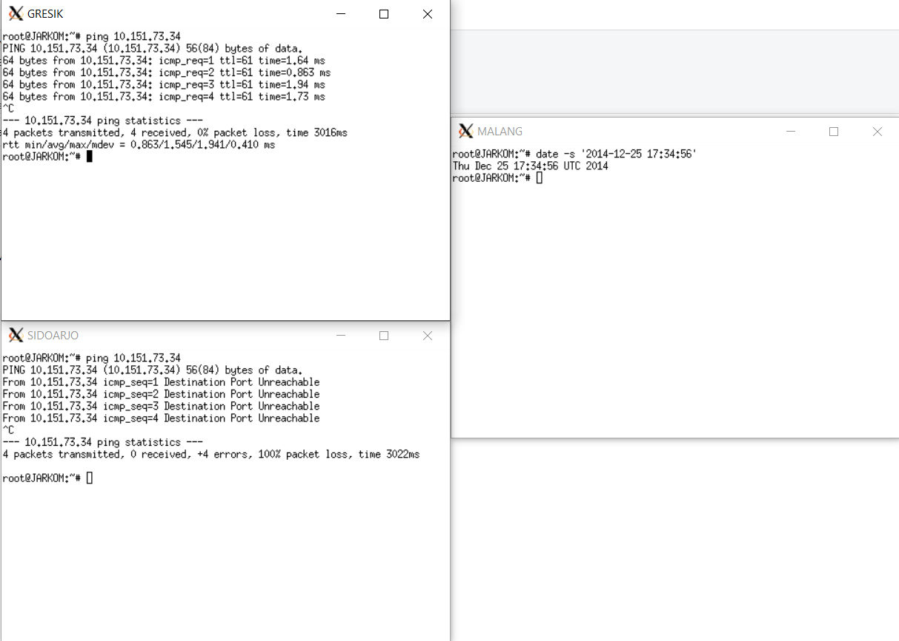
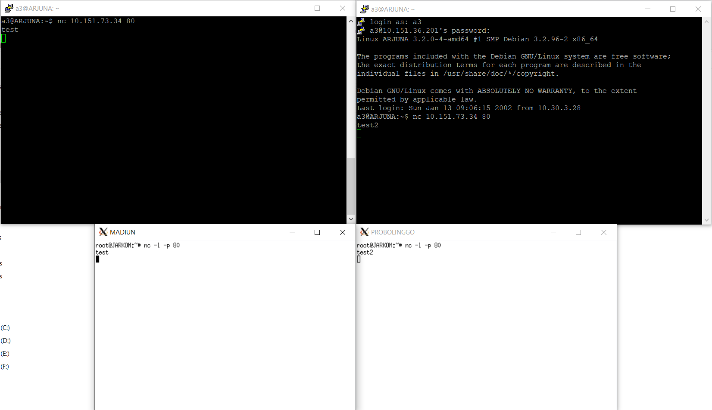
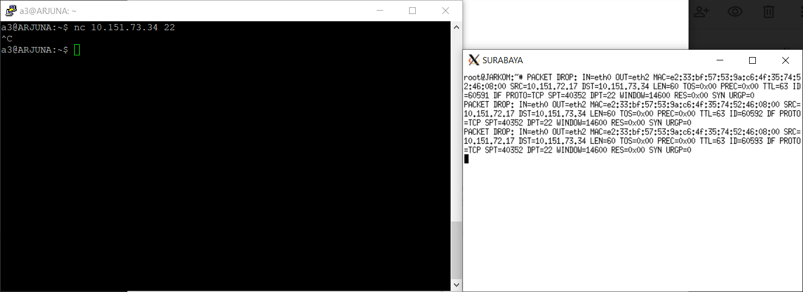
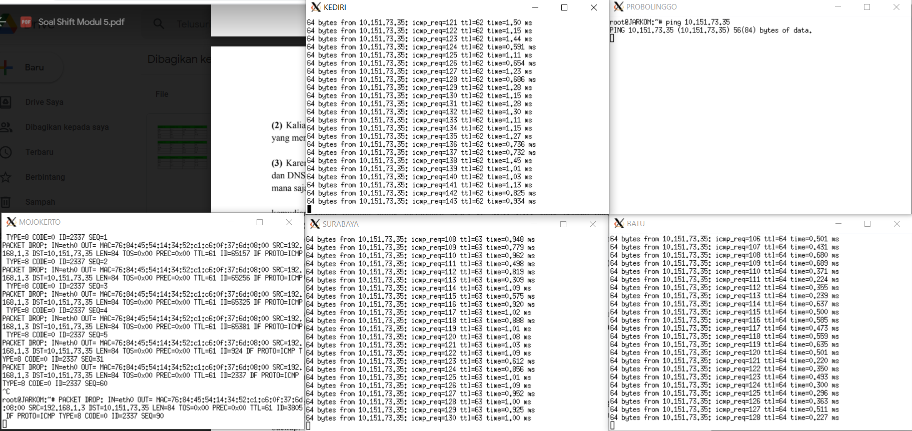

# Jarkom_Modul5_Lapres_A03

## TOPOLOGI



Setting UML topologi adalah sebagai berikut :

```
# Switch
uml_switch -unix switch1 > /dev/null < /dev/null &
uml_switch -unix switch2 > /dev/null < /dev/null &
uml_switch -unix switch3 > /dev/null < /dev/null &
uml_switch -unix switch4 > /dev/null < /dev/null &
uml_switch -unix switch5 > /dev/null < /dev/null &
uml_switch -unix switch6 > /dev/null < /dev/null &

# Router
xterm -T SURABAYA -e linux ubd0=SURABAYA,jarkom umid=SURABAYA eth0=tuntap,,,'10.151.72.17' eth1=daemon,,,switch4 eth2=daemon,,,switch3 mem=96M &
xterm -T BATU -e linux ubd0=BATU,jarkom umid=BATU eth0=daemon,,,switch3 eth1=daemon,,,switch5 eth2=daemon,,,switch2 mem=96M &
xterm -T KEDIRI -e linux ubd0=KEDIRI,jarkom umid=KEDIRI eth0=daemon,,,switch4 eth1=daemon,,,switch1 eth2=daemon,,,switch6 mem=96M &

# Server
xterm -T MALANG -e linux ubd0=MALANG,jarkom umid=MALANG eth0=daemon,,,switch2 mem=128M &
xterm -T MOJOKERTO -e linux ubd0=MOJOKERTO,jarkom umid=MOJOKERTO eth0=daemon,,,switch2 mem=128M &
xterm -T MADIUN -e linux ubd0=MADIUN,jarkom umid=MADIUN eth0=daemon,,,switch1 mem=128M &
xterm -T PROBOLINGGO -e linux ubd0=PROBOLINGGO,jarkom umid=PROBOLINGGO eth0=daemon,,,switch1 mem=128M &

# Klien
xterm -T SIDOARJO -e linux ubd0=SIDOARJO,jarkom umid=SIDOARJO eth0=daemon,,,switch5 mem=96M &
xterm -T GRESIK -e linux ubd0=GRESIK,jarkom umid=GRESIK eth0=daemon,,,switch6 mem=96M &
```

## SUBNETTING CIDR



Untuk mengatur interface pada setiap uml, kita jalankan command ```nano /etc/networking/interface``` untuk mengedit file. Selanjutnya menambahkan konfigurasi :

```
SURABAYA
-----------------------------------------------
auto eth0
iface eth0 inet static
address 10.151.72.18
netmask 255.255.255.252
gateway 10.151.72.17

auto eth1
iface eth1 inet static
address 192.168.2.1
netmask 255.255.255.252

auto eth2
iface eth2 inet static
address 192.168.5.1
netmask 255.255.255.252

BATU
----------------------------------------------
auto eth0
iface eth0 inet static
address 192.168.5.2
netmask 255.255.255.252
gateway 192.168.5.1

auto eth1
iface eth1 inet static
address 192.168.4.1
netmask 255.255.255.0

auto eth2
iface eth2 inet static
address 10.151.73.33
netmask 255.255.255.248

KEDIRI
------------------------------------------------
auto eth0
iface eth0 inet static
address 192.168.2.2
netmask 255.255.255.252
gateway 192.168.2.1

auto eth1
iface eth1 inet static
address 192.168.1.1
netmask 255.255.255.248

auto eth2
iface eth2 inet static
address 192.168.0.1
netmask 255.255.255.0

MALANG
-----------------------------------------------
auto eth0
iface eth0 inet static
address 10.151.73.34
netmask 255.255.255.248
gateway 10.151.73.33

MOJOKERTO
-----------------------------------------------
auto eth0
iface eth0 inet static
address 10.151.73.35
netmask 255.255.255.248
gateway 10.151.73.33

MADIUN
---------------------------------------------
auto eth0
iface eth0 inet static
address 192.168.1.2
netmask 255.255.255.248
gateway 192.168.1.1

PROBOLINGGO
-------------------------------------------------
auto eth0
iface eth0 inet static
address 192.168.1.3
netmask 255.255.255.248
gateway 192.168.1.1

SIDOARJO
------------------------------
auto eth0
iface eth0 inet dhcp

GRESIK
------------------------------
auto eth0
iface eth0 inet dhcp
```

Setelah itu, lakukan ```service networking restart``` untuk mengaktifkan konfigurasi tersebut. Untuk setiap router, lakukan setting pada sysctl dengan mengedit ```nano /etc/sysctl.conf``` dan hilangkan comment pada ```net.ipv4.ip_forward=1``` dan jalankan command ```sysctl -p``` untuk mengaktifkannya.

Melakukan Routing pada UML Surabaya :

```
SURABAYA
-------------------------------------------------------------------------
route add -net 10.151.73.32 netmask 255.255.255.248 gw 192.168.5.2
route add -net 192.168.4.0 netmask 255.255.255.0 gw 192.168.5.2
route add -net 192.168.0.0 netmask 255.255.254.0 gw 192.168.2.2
```

Buka konfigurasi interface dengan perintah ```nano /etc/default/isc-dhcp-server```. Kemudian, install DHCP Server pada MOJOKERTO dengan perintah ```apt-get install isc-dhcp-server```

Pada KEDIRI dan BATU, install DHCP Relay dengan ```apt-get install isc-dhcp-relay```. Lalu, masukkan IP DHCP server MOJOKERTO (10.151.73.35). Selanjutnya, kosongkan kolom interface untuk auto configure.


mengedit file ```/etc/dhcp/dhcpd.conf``` menjadi sebagai berikut:

```
subnet 192.168.4.0 netmask 255.255.255.0 {
    range 192.168.4.2 192.168.4.254;
    option routers 192.168.4.1;
    option broadcast-address 192.168.4.255;
    option domain-name-servers 10.151.73.34, 202.46.129.2;
    default-lease-time 600;
    max-lease-time 7200;
}

subnet 192.168.0.0 netmask 255.255.255.0 {
    range 192.168.0.2 192.168.0.254;
    option routers 192.168.0.1;
    option broadcast-address 192.168.0.255;
    option domain-name-servers 10.151.73.34, 202.46.129.2;
    default-lease-time 600;
    max-lease-time 7200;
}

subnet 10.151.73.32 netmask 255.255.255.248 {

}
```

Melakukan restart DHCP dengan perintah ```service isc-dhcp-server restart```

## Nomor 1

Menambahkan iptables pada SURABAYA :

```
iptables -t nat -A POSTROUTING -s 192.168.0.0/16 -o eth0 -j SNAT --to-source 10.151.72.18
```

Untuk melakukan test, maka kita bisa melakukan ping ke luar, contohnya google di semua UML yang ada. Jika sudah berhasil, maka akan muncul seperti contoh digambar sebagian UML ini:



## Nomor 2

Menambahkan iptables pada SURABAYA :

```
iptables -A FORWARD -p tcp --dport 22 -d 10.151.73.32/29 -i eth0 -j DROP
```

Untuk melakukan test, kita bisa melakukan netcat, yaitu melakukan listen pada malang dengan `nc -l -p 22` dan mengirim paket dengan port 22 melalui putty yang ada diluar topologi dengan `nc 10.151.73.34 22`. Maka akan terjadi seperti gambar dibawah:



## Nomor 3

Menambahkan iptables pada MALANG & MOJOKERTO :

```
iptables -A INPUT -p icmp -m connlimit --connlimit-above 3 --connlimit-mask 0 -j DROP
```

Untuk melakukan test, kita bisa melakukan ping dari UML lain ke malang atau mojokerto. Jika sudah berhasil, maka UML ke 4 yang ingin melakukan ping ke malang/mojokerto akan di drop, seperti pada UML probolinggo pada gambar dibawah.



## Nomor 4 dan 5

Menambahkan iptables pada MALANG :

```
iptables -A INPUT -s 192.168.4.0/24 -m time --timestart 07:00 --timestop 17:00 --weekdays Mon,Tue,Wed,Thu,Fri -j ACCEPT
iptables -A INPUT -s 192.168.0.0/24 -m time --timestart 17:00 --timestop 00:00 -j ACCEPT
iptables -A INPUT -s 192.168.0.0/24 -m time --timestart 00:00 --timestop 07:00 -j ACCEPT
iptables -A INPUT -s 192.168.4.0/24 -j REJECT
iptables -A INPUT -s 192.168.0.0/24 -j REJECT
```

Untuk melakukan test, kita bisa ping malang dari gresik atau sidoarjo dan mengganti tanggal nya sesuai dengan soal untuk mengetahui apakah berhasil. Maka hasilnya akan menjadi seperti gambar berikut:




## Nomor 6

Menambahkan iptables pada SURABAYA :

```
iptables -A PREROUTING -t nat -p tcp -d 10.151.73.34 --dport 80 -m statistic --mode nth --every 2 --packet 0 -j DNAT --to-destination 192.168.1.2
iptables -A PREROUTING -t nat -p tcp -d 10.151.73.34 --dport 80 -j DNAT --to-destination 192.168.1.3
iptables -t nat -A POSTROUTING -p tcp --dport 80 -d 192.168.1.2 -j SNAT --to-source 192.168.1.10
iptables -t nat -A POSTROUTING -p tcp --dport 80 -d 192.168.1.3 -j SNAT --to-source 192.168.1.10

```


## Nomor 7

Menggabungkan konfigurasi bersama perintah iptables DROP pada nomor 2 dan 3 :

### SURABAYA (nomor 2)

```
iptables -N LOGGING
iptables -A FORWARD -p tcp --dport 22 -d 10.151.73.32/29 -i eth0 -j LOGGING
iptables -A LOGGING -m limit --limit 2/min -j LOG --log-prefix "PACKET DROP: " --log-level info
iptables -A LOGGING -j DROP
```

Untuk melakukan test, lakukan sama seperti nomor 2, dan sekarang lihat pada UML surabaya akan mengeluarkan log paket yang didrop seperti pada gambar berikut:



### MALANG dan MOJOKERTO (nomor 3):

```
iptables -N LOGGING
iptables -A INPUT -p icmp -m connlimit --connlimit-above 3 --connlimit-mask 0 -j LOGGING
iptables -A LOGGING -m limit --limit 2/min -j LOG --log-prefix "PACKET DROP: " --log-level info
iptables -A LOGGING -j DROP
```

Untuk melakukan test, lakukan sama seperti nomor 3, dan sekarang lihat pada UML mojokerto/malang akan mengeluarkan log paket yang didrop seperti pada gambar berikut:


